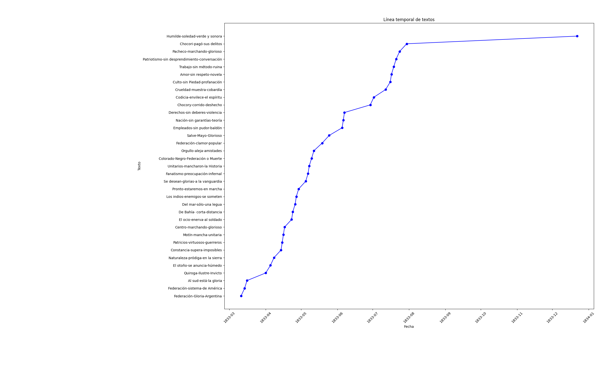
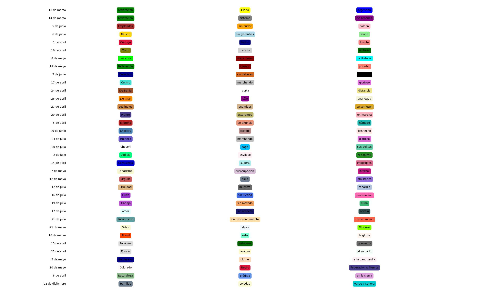

la mitad de las fuentes van a decir que eran frases de adoctrinamiento, un ejercicio literario. la otra mitad que tenian un significado/utilidad por atras

Me lo tomo literal porque puedo.



```
requency count:>>>>>>>
[('Federación', 3), ('marchando', 2), ('glorioso', 2), ('Gloria', 1), ('Argentina', 1), ('sistema', 1), ('de América', 1), ('Empleados', 1), ('sin pudor', 1), ('baldón', 1), ('Nación', 1), ('sin garantías', 1), ('teoría', 1), ('Quiroga', 1), ('Ilustre', 1), ('Invicto', 1), ('Motín', 1), ('mancha', 1), ('unitaria', 1), ('Unitarios', 1), ('mancharon', 1), ('la Historia', 1), ('clamor', 1), ('popular', 1), ('Derechos', 1), ('sin deberes', 1), ('violencia', 1), ('Centro', 1), ('De Bahía', 1), (' corta', 1), ('distancia', 1), ('Del mar', 1), ('sólo', 1), ('una legua', 1), ('Los indios', 1), ('enemigos', 1), ('se someten', 1), ('Pronto', 1), ('estaremos', 1), ('en marcha', 1), ('El otoño', 1), ('se anuncia', 1), ('húmedo', 1), ('Chocory', 1), ('corrido', 1), ('deshecho', 1), ('Pacheco', 1), ('Chocori', 1), ('pagó', 1), ('sus delitos', 1), ('Codicia', 1), ('envilece', 1), ('el espíritu', 1), ('Constancia', 1), ('supera', 1), ('imposibles', 1), ('Fanatismo ', 1), ('preocupación', 1), ('infernal', 1), ('Orgullo', 1), ('aleja', 1), ('amistades', 1), ('Crueldad', 1), ('muestra', 1), ('cobardía', 1), ('Culto', 1), (' sin Piedad', 1), ('profanación', 1), ('Trabajo', 1), ('sin método', 1), ('ruina', 1), ('Amor', 1), (' sin respeto', 1), ('novela', 1), ('Patriotismo', 1), ('sin desprendimiento', 1), ('conversación', 1), ('Salve', 1), ('Mayo ', 1), ('Glorioso', 1), ('Al sud', 1), ('está', 1), ('la gloria', 1), ('Patricios', 1), ('virtuosos', 1), ('guerreros', 1), ('El ocio', 1), ('enerva', 1), ('al soldado', 1), ('Se desean', 1), ('glorias', 1), ('a la vanguardia', 1), ('Colorado', 1), ('Negro', 1), ('Federación o Muerte', 1), ('Naturaleza', 1), ('pródiga', 1), ('en la sierra', 1), ('Humilde', 1), ('soledad', 1), ('verde y sonora', 1)]


{'11 de marzo': 'Federación-Gloria-Argentina', '14 de marzo': 'Federación-sistema-de América', '19 de mayo': 'Federación-clamor-popular', '17 de abril': 'Centro-marchando-glorioso', '24 de julio': 'Pacheco-marchando-glorioso', '10 de mayo': 'Colorado-Negro-Federación o Muerte'}
federacion_dates
['11', '14', '19', '10']
```


https://play.google.com/books/reader?id=i39pAAAAIAAJ&pg=GBS.PA184&hl=es&q=santos


Historia argentina: Unitarios y federales (1826-1841)
